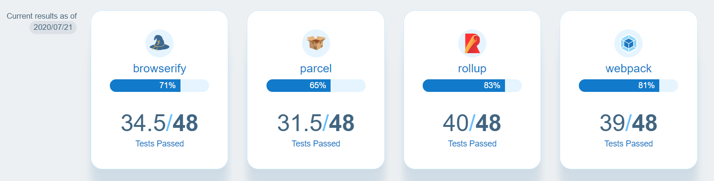

= Bundling
:toc:
:toclevels: 4
:icons: font

toc::[]

NOTE: Check this https://bundlers.tooling.report/[link] for consolidated information of all build tools.

== Youtube

https://www.youtube.com/watch?v=ahRNMEA4mWw[Webpack vs Browserify vs SystemJS vs require.js]

== Browserify

- OG Bundler.
- Simple and limited.

== Rollup

== Parcel

== Webpack

1. Bundling of files
2. Performance

In Webpack, `bundle.js` (Found under DevTools) is the complete code to find for transpiled code.

== How to debug transpiled and bundle code?
*Using SourceMaps*
Maps code to original source.
SourceMaps only in DevTools, hence not delivered to users, minimising JS bundle cost.

== JSPM
